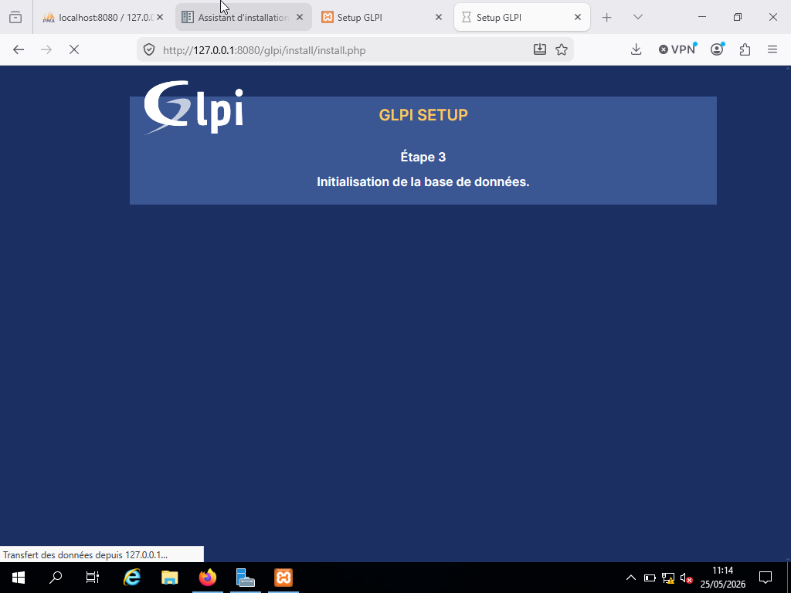
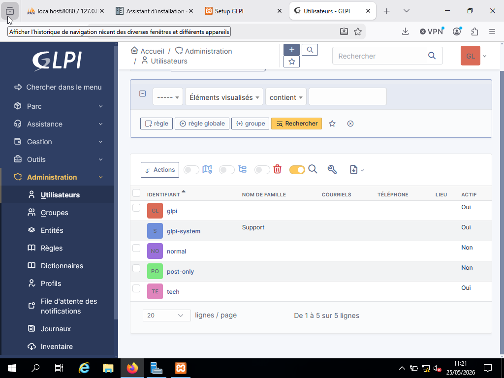

# Installation de GLPI

Installation et validation de GLPI afin de préparer un environnement de support IT pour la gestion des utilisateurs, des incidents et des demandes.

(../../Captures-d'écran/Installation-GLPI/01-selection-langue.png)

