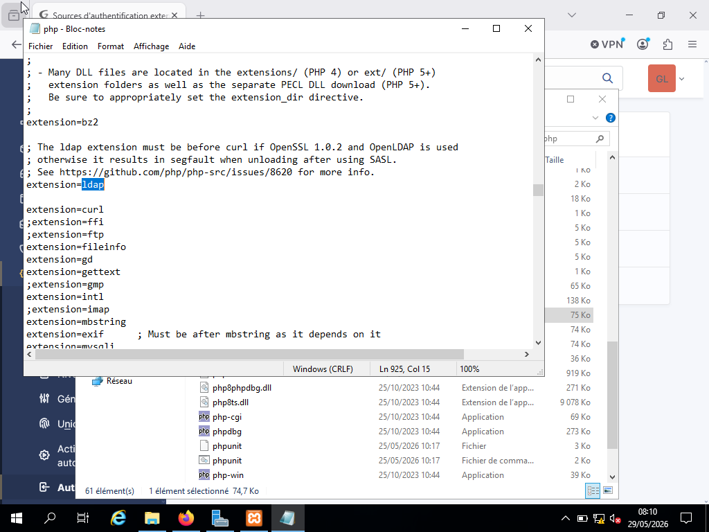
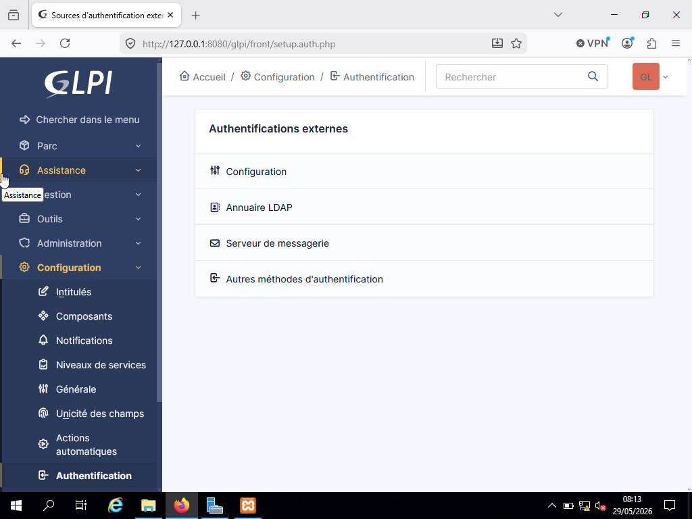
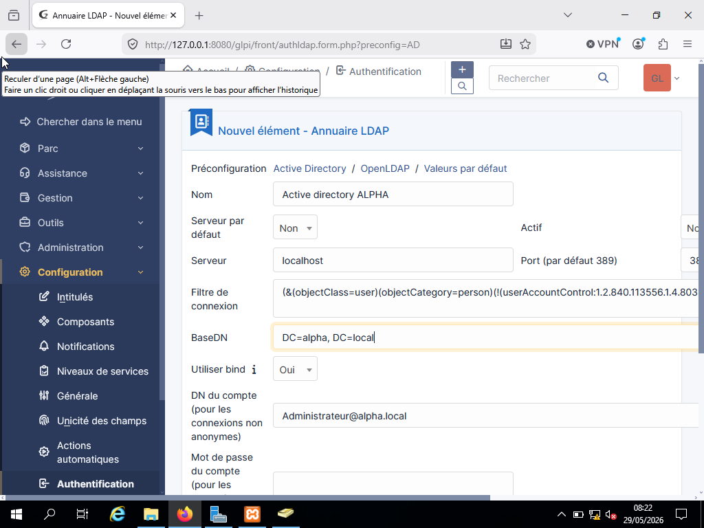
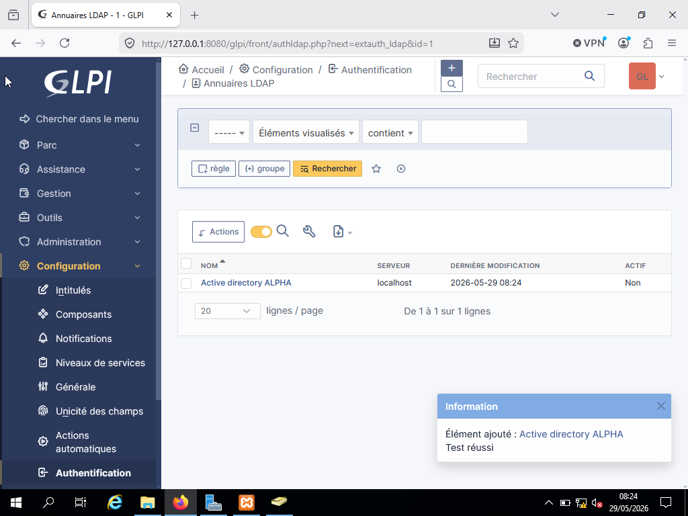
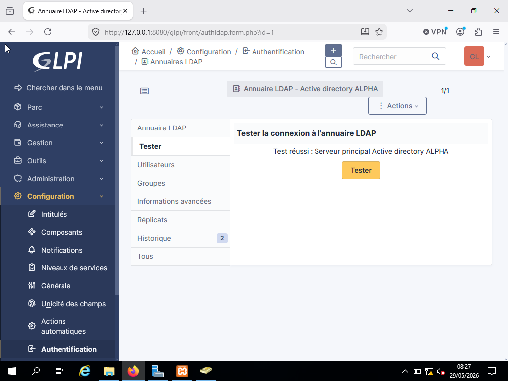
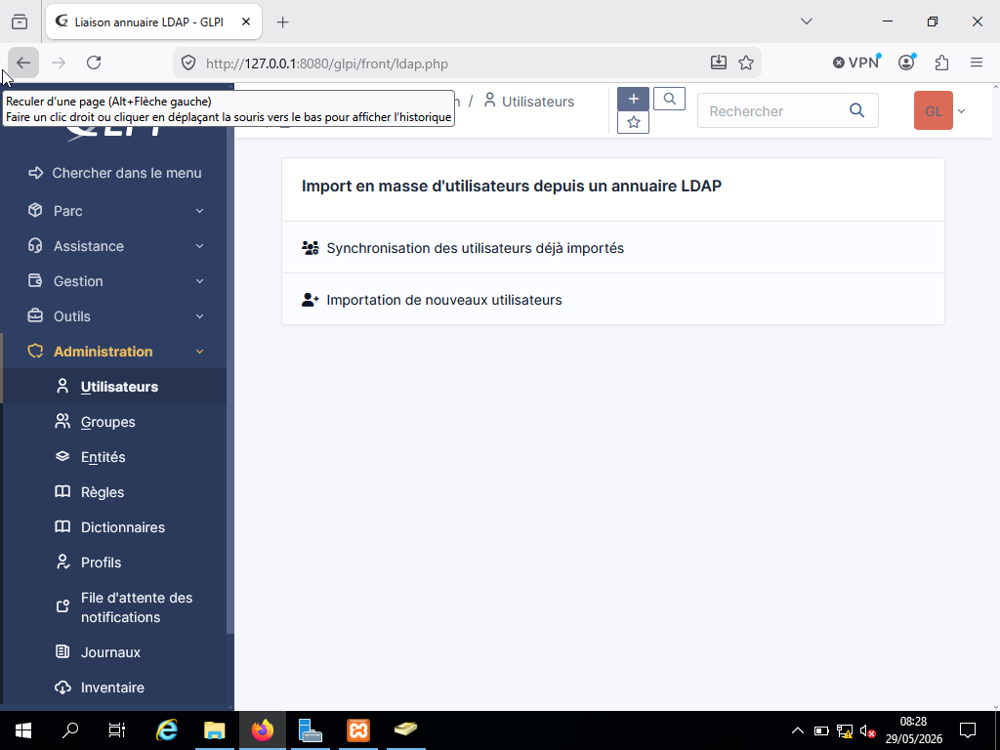
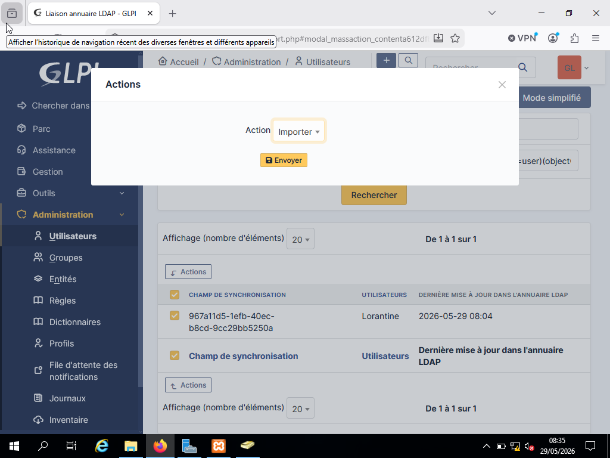
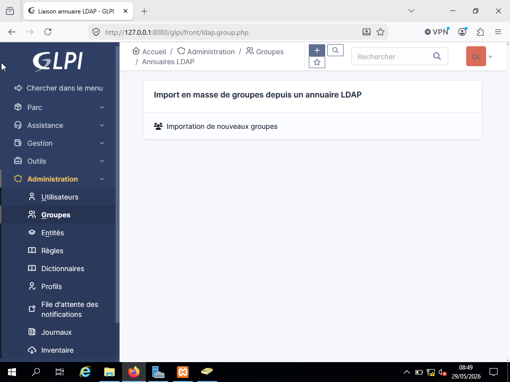

## Profils Utilisateurs et techniciens
Création manuelle des utilisateurs et techniciens, puis importation des comptes depuis l'Active Directory via LDAP pour centraliser la gestion des accès.

.png)

